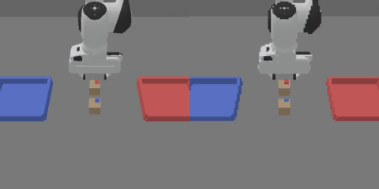
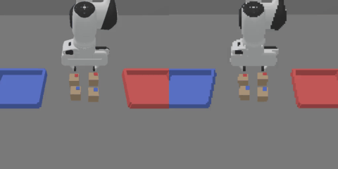
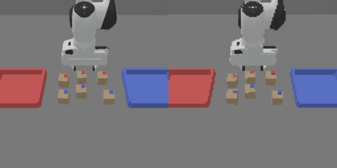
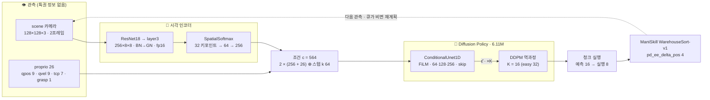

[English](README.md) | 한국어

<div align="center">

# 📦 WarehouseSort · RGB Diffusion Policy

### 무료 Colab T4에서 학습한 카메라 전용 소포 분류 정책, 600 에피소드 고정 시드 검증

*Marso Hack Berlin 2026 스타터의 대회 종료 후 포크. 정책은 128×128 장면 카메라와 26차원 자기 수용 감각만 보고, fresh_seed / stress 프로토콜에서 가중 정렬 정확도 0.9075 / 0.7336을 기록했다.*

<p>
  
  
  
  
  
</p>

<p>
  
  
  
  
  
  <a href="LICENSE"></a>
</p>

[](https://colab.research.google.com/github/mrpc2003/berlin-marso-hackathon/blob/main/MARSO_COLAB.ipynb)

</div>

---

## 📑 목차

- [🧭 소개](#-소개)
- [🎯 핵심 결과](#-핵심-결과)
- [🏗 모델 구조](#-모델-구조)
- [🔧 스타터에서 바꾼 것](#-스타터에서-바꾼-것)
- [🧪 검증 프로토콜](#-검증-프로토콜)
- [🛠 기술 스택](#-기술-스택)
- [🗂 저장소 구조](#-저장소-구조)
- [🚀 빠른 시작](#-빠른-시작)
- [📝 재현](#-재현)
- [🔒 Git에 들어가는 것과 들어가지 않는 것](#-git에-들어가는-것과-들어가지-않는-것)
- [⚠️ 한계](#️-한계)
- [📚 출처와 라이선스](#-출처와-라이선스)
- [👤 작성자](#-작성자)

## 🧭 소개

이 저장소는 Kaggle [Marso Hack Berlin 2026 — Robot Parcel Sorting Challenge](https://www.kaggle.com/competitions/marso-hack-berlin-2026-robot-parcel-sorting-challenge)의 스타터 [marso-robotics/berlin-marso-hackathon](https://github.com/marso-robotics/berlin-marso-hackathon)을 포크한 것이다. ManiSkill 3 안에서 Franka Panda가 소포 윗면의 색 태그를 읽어 같은 색 분류함에 넣는 과제이며, 대회는 2026-06-21에 끝났다. 이 포크는 선택 트랙이던 **RGB 트랙**을 대회 종료 뒤에 끝까지 풀어 본 기록으로, 학습은 무료 Colab T4 세션에서만 했고 검증은 결과를 보기 전에 봉인한 600 에피소드 프로토콜로 했다.

> **한 줄 요약** — 6.11M 파라미터 RGB Diffusion Policy(ResNet18 + SpatialSoftmax → FiLM 조건 1D U-Net, DDPM)가 새 시드에서 easy 0.990 / medium 0.890 / hard 0.885(가중 0.9075), 교란을 넓힌 stress에서 0.7336의 정렬 정확도를 냈다. 대회 당시 검증된 RGB 최고 기록은 ACT의 가중 약 0.21이었고 순수 RGB Diffusion Policy로 0이 아닌 점수를 낸 참가자는 없었다(채점 시드가 달라 직접 비교는 불가).

포크가 더한 것은 Colab T4용 RGB 학습·평가 워크플로(청크 실행, 레벨별 에피소드 예산, 시범 행동 클리핑, 스트리밍 h5 로더, 정확한 재개), 제출용 체크포인트 3개와 `submission.yaml`, 고정 검증 레인(`tools/run_generalization.py`), 한국어 보고서다. 원래 스타터 README는 [docs/UPSTREAM_README.md](docs/UPSTREAM_README.md)에 그대로 보존했고, 제출 계약은 [SUBMISSION.md](SUBMISSION.md)에 있다.

| easy (소포 2개) | medium (소포 4개) | hard (소포 6개, 분류함 교환 가능) |
|:---:|:---:|:---:|
|  |  |  |

<sub>스타터의 스크립트 시범 정책이 푸는 모습(시범 데이터의 출처). 왼쪽은 장면 뷰, 오른쪽은 정책이 보는 카메라.</sub>

## 🎯 핵심 결과

레벨당 100 에피소드 × 프로토콜 2종 = 600회. 시드와 교란 범위는 [docs/VALIDATION_PROTOCOL.md](docs/VALIDATION_PROTOCOL.md)에 먼저 고정했고, 단계마다 `result.json`을 봉인해 사후 선택을 막았다. **공식 held-out 점수가 아니다.** 전체 보고서는 [docs/WRITEUP.md](docs/WRITEUP.md).

| 프로토콜 | 레벨 | 에피소드 | 정렬 정확도 | 전량 배치 | 오분류 | 평균 스텝 |
|---|---|---:|---:|---:|---:|---:|
| fresh_seed (시드 6000–6099) | easy | 100 / 100 | **0.9900** | 0.98 | 0.00000 | 114.5 |
| fresh_seed | medium | 100 / 100 | **0.8900** | 0.86 | 0.00500 | 271.5 |
| fresh_seed | hard | 100 / 100 | **0.8850** | 0.76 | 0.00167 | 460.8 |
| stress (시드 8000–8099, 교란 확대) | easy | 100 / 100 | **0.9750** | 0.95 | 0.00000 | 118.2 |
| stress | medium | 100 / 100 | **0.7175** | 0.67 | 0.00000 | 324.0 |
| stress | hard | 100 / 100 | **0.6467** | 0.41 | 0.01000 | 617.7 |

| 가중 합 (0.2 / 0.3 / 0.5) | fresh_seed | stress |
|---|---:|---:|
| 정렬 정확도 | **0.9075** | **0.7336** |

- 오분류는 모든 단계에서 1% 이하다. 실패는 잘못된 분류함이 아니라 예산 안에 다 옮기지 못한 경우다.
- easy fresh_seed는 배치가 고정된 레벨이라 공간 일반화가 아니라 반복성 검사에 가깝다.
- stress hard는 첫 실행의 VM이 8/100에서 회수돼 같은 체크포인트·시드로 단독 재실행했고, 겹치는 8회 결과가 비트 단위로 같았다(`--stages stress/hard`).

**판정자 방식 클린 클론 스모크** (2026-09-15, 별도 T4 호스트): `git clone main` → `pixi install --locked`(141 s, torch 2.12.0+cu130 · numpy 2.4.6 · mani_skill 3.0.1) → `eval.py`. eval32 easy 0.984 / medium 1.000 / hard 0.953으로 학습 런타임 기준값(1.000 / 0.984 / 0.964)과 최대 1.6 pt 차이. 기록: [docs/EXPERIMENTS.md](docs/EXPERIMENTS.md) S5.

**제출본 무결성 검사 6 / 6 통과**: 스트립 뒤 EMA 가중치 비트 동일 3/3 · strict 로드 missing 0 / unexpected 0 · 채점 계약 load → act 3/3 · 오프라인 fresh clone 로드 3/3 · 검증에 쓴 EMA SHA256 ↔ 제출 파일 3/3 · 체크포인트당 35.8 MB < 100 MB.

## 🏗 모델 구조



| 항목 | 값 |
|---|---|
| 알고리즘 | `BC_Diffusion_rgb_UNet` (`il/baselines/diffusion_policy/train_rgbd.py`) · 파라미터 6.11M |
| 관측 / 행동 | rgb 128×128×3 + state 26 · obs_horizon 2 → pred_horizon 16 → act_horizon 8 · 행동 4차원 `[−1, 1]` |
| 인코더 | ResNet18 ImageNet 초기화, BN→GroupNorm, layer3에서 절단 → 1×1 conv 32 → SpatialSoftmax (x, y)×32 → Linear 256 |
| 잡음 예측기 | ConditionalUnet1D, down_dims [64, 128, 256], kernel 5, GroupNorm 8, mid ×2, FiLM 조건 |
| 확산 | DDPM 100 학습 스텝, squaredcos_cap_v2, ε 예측, clip_sample · 추론 16 스텝(easy 32) |
| 최적화 | AdamW 1e-4, β (0.95, 0.999), wd 1e-6 · cosine (warmup 500) · AMP · EMA power 0.75 · batch 128 |
| 데이터 | 레벨별 시범 200개, (관측 2, 행동 16) 창, pad 1 / 14, 행동 clip [−1, 1], RandomShift pad 4 |
| 학습 / 선택 | easy 25k · medium 30k · hard 40k iter · 5k마다 EMA로 32회 롤아웃 → best EMA 15k · 25k · 35k |
| 제출본 | `checkpoints/rgb_dp_{easy,medium,hard}.pt` = EMA 가중치 + config (`tools/strip_ckpt.py`), 각 35.8 MB |

## 🔧 스타터에서 바꾼 것

참가자 writeup과 스타터 코드 자체 측정에서 찾은 구조적 문제들이다(전체 근거는 [docs/RESEARCH.md](docs/RESEARCH.md)).

1. **청크 실행** — 스타터의 RGB 정책은 매 스텝 새 확산 계획을 뽑아 첫 행동만 실행했고 관측 이력을 위조했다. `warehouse_sort/il_policy.py`의 `ChunkedPolicy`가 학습 중 평가기와 같은 방식으로 계획 하나당 `act_horizon` 8개 행동을 실행한다.
2. **레벨별 에피소드 예산** — 시범은 easy/medium/hard에서 약 115 / 235 / 350–780 스텝이 걸리는데 `max_episode_steps`는 200으로 고정돼 있었다. 250 / 500 / 800으로 분리했다.
3. **시범 행동 클리핑** — 스크립트 정책의 이동량이 3.66까지 나오지만 시뮬레이터는 [−1, 1]로 잘라 실행한다. 로더가 실행값과 같게 클리핑한다.
4. **스트리밍 h5 로더와 GPU 상주 uint8 데이터셋** — 전체 h5를 RAM에 올리던 로더를 대체해 hard(3.8 GB)도 Colab에서 돈다. `capture_video=false`로 5 GB짜리 프레임 버퍼를 피했다.
5. **정확한 재개와 config 포함 체크포인트** — 2.5k마다 optimizer · scheduler · EMA · RNG까지 저장해 Colab 세션이 끊겨도 이어 학습한다. 모든 체크포인트가 `config`를 실어 로더가 그대로 모델을 복원한다.

## 🧪 검증 프로토콜

`docs/VALIDATION_PROTOCOLS.json`이 기계 판독용 원본이며 100개 시드 전부를 담고 있다. 선택용 시드(5000+)와 학습 중 평가 시드와 겹치지 않는다.

| 프로토콜 / 레벨 | 소포 XY (m) | Yaw (rad) | 분류함 교환 확률 | 분류함 XY (m) | 소포 / 최대 스텝 |
|---|---|---|---:|---|---|
| fresh_seed / easy | 0 | 0 | 0 | 0 | 2 / 250 |
| fresh_seed / medium | ±0.015 | 0 | 0 | 0 | 4 / 500 |
| fresh_seed / hard | ±0.020 | ±0.10 | 0.5 | 0 | 6 / 800 |
| stress / easy | ±0.010 | ±0.05 | 0 | ±0.005 | 2 / 250 |
| stress / medium | ±0.025 | ±0.05 | 0 | ±0.005 | 4 / 500 |
| stress / hard | ±0.030 | ±0.15 | 0.5 | ±0.010 | 6 / 800 |

- 4개 환경이 4개씩 순차 배치(단계당 25배치)로 돈다. 배치 크기가 난수 흐름을 바꾸므로 고정했다.
- 단계마다 `result.json`을 봉인하고 tmux로 순차 실행한다. 봉인된 단계는 재사용하지 않고, 중단된 단계만 `--stages`로 다시 돈다.
- 실행 전에 프로토콜 JSON의 SHA256, 허용된 소스 파일 해시, 입력 manifest 해시, 완전히 해석된 설정을 저장한다.

## 🛠 기술 스택

| 역할 | 도구 |
|---|---|
| 시뮬레이션 | ManiSkill 3.0.1 · SAPIEN 3.0.3 · Vulkan/EGL 렌더링 (T4에서 동작) |
| 모델 | PyTorch 2.11 (+cu128, 학습) · torchvision ResNet18 · diffusers 0.38 DDPMScheduler |
| 설정 · 학습 | Hydra 메서드 설정 (`il/conf/method/dp_rgb_*.yaml`) · AMP · EMA · TensorBoard |
| 연산 | 무료 Colab T4 세션(≤ 3 h), Drive 기반 체크포인트 재개 · 판정 스모크는 SSH T4 호스트 |
| 검증 | `tools/run_generalization.py` 고정 레인 · 봉인 `result.json` · tmux · 에피소드별 `episodes.jsonl` |
| 패키징 | `pixi.lock` (판정 환경: torch 2.12.0+cu130, numpy 2.4.6) · `tools/strip_ckpt.py` · SHA256 대조 |
| 테스트 | pytest, 시뮬레이터 없이 CPU에서 17개 테스트 파일 |

## 🗂 저장소 구조

```text
berlin-marso-hackathon/
├── README.md / README.ko.md           # 포크 개요 (이 문서)
├── SUBMISSION.md                      # 제출 계약 (upstream)
├── submission.yaml                    # ★ RGB 트랙 manifest: 정책 엔트리포인트 + 체크포인트 3개
├── checkpoints/                       # ★ rgb_dp_{easy,medium,hard}.pt — 스트립된 EMA + config, 각 35.8 MB
├── warehouse_sort/                    # WarehouseSort-v1 환경 + 정책 로더 (★ il_policy.py의 ChunkedPolicy)
├── il/                                # 모방학습
│   ├── conf/method/dp_rgb_*.yaml      # ★ 레벨별 RGB DP 설정
│   ├── train.py · gen_demos.py        # Hydra 디스패처 · 시범 기록기 (★ DART 잡음, 교란 오버라이드)
│   └── baselines/                     # vendored ManiSkill DP (★ 스트리밍 로더, 재개) + ACT 대비책
├── conf/                              # 난이도 · 평가 설정 (★ 레벨별 max_episode_steps, eval32 / eval64)
├── tools/                             # ★ 검증 레인, 체크포인트 스트립, Colab 노트북 생성기
├── docs/                              # ★ RESEARCH · EXPERIMENTS · WRITEUP · VALIDATION_PROTOCOL(.json) · REPRODUCE
├── tests/                             # CPU 테스트 (시뮬레이터 불필요)
├── MARSO_COLAB*.ipynb                 # ★ Colab T4 세션 노트북 (학습 · stress 재실행 · 클린 클론 스모크)
├── eval.py · starter.ipynb · pixi.toml · pixi.lock
└── outputs/                           # ignored: 검증 증거, 세미나 자료, 실험 로그
```

## 🚀 빠른 시작

판정자와 같은 절차로 제출본을 실행한다(`pixi.lock`이 판정 환경 버전을 고정한다).

```bash
git clone https://github.com/mrpc2003/berlin-marso-hackathon.git
cd berlin-marso-hackathon
pixi install --locked          # torch 2.12.0+cu130 · numpy 2.4.6 · mani_skill 3.0.1

pixi run python eval.py difficulty=hard obs_mode=rgb \
    policy=warehouse_sort.il_policy:load_dp_rgb \
    checkpoint=checkpoints/rgb_dp_hard.pt \
    eval_config=conf/eval/eval32.yaml record_video=false

python -m pytest tests -q      # CPU 테스트, 시뮬레이터 불필요
```

`difficulty=easy|medium`은 같은 명령에 체크포인트만 바꾸면 된다. 추론 설정(act_horizon, 잡음 제거 횟수)은 체크포인트 config에 들어 있어 추가 인자가 없다.

## 📝 재현

**Colab T4에서 학습** (세션 노트북 [MARSO_COLAB.ipynb](MARSO_COLAB.ipynb), hard는 [MARSO_COLAB_HARD.ipynb](MARSO_COLAB_HARD.ipynb)):

```bash
pip install -e . && python il/download_demos.py           # Kaggle 토큰 필요, 레벨별 시범 200개
python il/train.py method=dp_rgb_hard                    # 40k iter · 2.5k마다 latest.pt(재개) · 5k마다 EMA 평가
python tools/strip_ckpt.py \
    il/baselines/diffusion_policy/runs/<exp>/checkpoints/best_eval_sort_accuracy.pt \
    checkpoints/rgb_dp_hard.pt
```

**600 에피소드 검증** (고정 프로토콜, 결과 봉인):

```bash
pixi run python tools/run_generalization.py --run \
    --manifest docs/VALIDATION_INPUT.example.json --out /content/marso-validation
pixi run python tools/run_generalization.py --run --stages stress/hard    # 중단된 단계 하나만
```

**클린 클론 판정 스모크**: [MARSO_CLEAN_CLONE_SMOKE_20260915.ipynb](MARSO_CLEAN_CLONE_SMOKE_20260915.ipynb). 학습 런타임(torch 2.11)과 판정 환경(torch 2.12)의 수치 차이는 에피소드 단위로 나타나므로 100회 기준 4–5 pt 안쪽은 잡음으로 본다.

문서: [RESEARCH.md](docs/RESEARCH.md) (참가자 발견과 자체 측정) · [EXPERIMENTS.md](docs/EXPERIMENTS.md) (append-only 실행 로그) · [WRITEUP.md](docs/WRITEUP.md) (최종 보고) · [VALIDATION_PROTOCOL.md](docs/VALIDATION_PROTOCOL.md) · [REPRODUCE.md](docs/REPRODUCE.md).

## 🔒 Git에 들어가는 것과 들어가지 않는 것

| Git에 포함 | Git에서 제외 |
|---|---|
| 정책 · 학습 · 검증 코드, Hydra 설정 | 시범 데이터셋 (`il/demos/`, Kaggle에서 받음) |
| 스트립된 체크포인트 3개 (각 35.8 MB) + `submission.yaml` | 전체 트레이너 체크포인트, optimizer 상태, TensorBoard 로그 |
| 고정 프로토콜 JSON, 문서, 실행 로그 요약 | `outputs/` — 원본 검증 증거, 롤아웃 영상, 세미나 자료, 복구 실험 |
| 세션 노트북 4개 (학습 · stress 재실행 · 클린 클론 스모크) | 중간 세션 노트북 12개, Kaggle · Drive 자격 증명 |

`.gitignore`가 `outputs/`, 시범 데이터, 런 디렉터리를 막는다. 노트북은 Colab Secrets를 쓰며 토큰을 커밋하지 않는다.

## ⚠️ 한계

- 위 수치는 자체 검증값이며 **공식 held-out 점수가 아니다**. 채점 환경의 시드와 교란 범위는 알 수 없다.
- stress hard가 0.6467로 떨어진다(전량 배치 41%, 평균 618 스텝 / 예산 800). 실패는 시간 초과와 막힘이지 오분류(≤ 1%)가 아니다. 시범이 스크립트 정책 한 종류라 복구 동작을 배운 적이 없기 때문이다.
- 복구 시범 재학습(2026-09-16, DART식 광폭 교란 시범 추가, T4 4장)은 easy·hard에서 이득이 없었고 medium은 fresh +8.75 pt / stress −6.5 pt로 엇갈려 제출본을 바꾸지 않았다.
- 레벨마다 다른 체크포인트를 쓴다. 소포 격자가 소포 수에 따라 달라 hard 전용 정책이 easy로 옮겨지지 않는다.
- 실제 로봇 전이(카메라·접촉 물리 차이)는 검증하지 않았다. 범위는 시뮬레이터까지다.

## 📚 출처와 라이선스

- Upstream 스타터: [marso-robotics/berlin-marso-hackathon](https://github.com/marso-robotics/berlin-marso-hackathon) — 원문 README는 [docs/UPSTREAM_README.md](docs/UPSTREAM_README.md).
- [ManiSkill 3](https://maniskill.readthedocs.io/en/latest/) ([arXiv 2410.00425](https://arxiv.org/abs/2410.00425)) · [Diffusion Policy](https://diffusion-policy.cs.columbia.edu) (Chi et al. 2023) · [LeRobot](https://github.com/huggingface/lerobot) 관례.
- 청크 실행, DrQ random-shift 증강, 재개, 레벨별 에피소드 길이 같은 아이디어는 대회 참가자들의 공개 포크와 Kaggle writeup(CC BY 4.0)에서 가져왔다. 이름은 [docs/RESEARCH.md](docs/RESEARCH.md)에 적었다.
- 이 포크가 추가한 코드는 [MIT License](LICENSE)를 따른다. Upstream 코드와 시범 데이터는 각자의 조건을 따른다.

## 👤 작성자

[@mrpc2003](https://github.com/mrpc2003) — 김우현, 국민대학교 AI 전공.

<div align="center">

<sub>카메라 영상만으로, 무료 T4 위에서, 결과를 보기 전에 봉인한 600회로.</sub>

</div>
