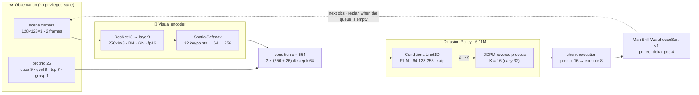

English | [한국어](README.ko.md)

<div align="center">

# 📦 WarehouseSort · RGB Diffusion Policy

### Camera-only parcel sorting trained on a free Colab T4, validated on 600 frozen-seed episodes

*Post-competition fork of the Marso Hack Berlin 2026 starter. The policy sees a 128×128 scene camera and 26-d proprioception only, and reaches 0.9075 / 0.7336 weighted sort accuracy on the fresh_seed / stress protocols.*

<p>
  
  
  
  
  
</p>

<p>
  
  
  
  
  
  <a href="LICENSE"></a>
</p>

[](https://colab.research.google.com/github/mrpc2003/berlin-marso-hackathon/blob/main/MARSO_COLAB.ipynb)

</div>

---

## 📑 Table of Contents

- [🧭 About](#-about)
- [🎯 Headline Results](#-headline-results)
- [🏗 Architecture](#-architecture)
- [🔧 What Changed vs. the Starter](#-what-changed-vs-the-starter)
- [🧪 Validation Protocol](#-validation-protocol)
- [🛠 Tech Stack](#-tech-stack)
- [🗂 Project Structure](#-project-structure)
- [🚀 Quick Start](#-quick-start)
- [📝 Reproducing](#-reproducing)
- [🔒 What Is (Not) in Git](#-what-is-not-in-git)
- [⚠️ Limitations](#️-limitations)
- [📚 Attribution and License](#-attribution-and-license)
- [👤 Author](#-author)

## 🧭 About

This repository is my fork of [marso-robotics/berlin-marso-hackathon](https://github.com/marso-robotics/berlin-marso-hackathon), the starter for the Kaggle [Marso Hack Berlin 2026 — Robot Parcel Sorting Challenge](https://www.kaggle.com/competitions/marso-hack-berlin-2026-robot-parcel-sorting-challenge). A Franka Panda in ManiSkill 3 has to read the color tag on each parcel and drop it into the matching bin. The competition closed on 2026-06-21; this fork is a post-competition attempt at the optional **RGB track**, trained only on free Colab T4 sessions and validated on a 600-episode protocol that was sealed before any result was seen.

> **TL;DR** — A 6.11M-parameter RGB Diffusion Policy (ResNet18 + SpatialSoftmax → FiLM-conditioned 1D U-Net, DDPM) reaches easy 0.990 / medium 0.890 / hard 0.885 sort accuracy on fresh seeds (weighted 0.9075) and 0.7336 under wider stress randomization. During the competition the verified RGB best was ACT at roughly 0.21 weighted, and no participant reported a nonzero pure-RGB Diffusion Policy score (different judge seeds, so not directly comparable).

What the fork adds: an RGB training and evaluation workflow that fits Colab T4 (chunked deployment, per-level episode budgets, clipped demo actions, streaming h5 loader, exact resume), three stripped checkpoints plus `submission.yaml`, a frozen validation lane (`tools/run_generalization.py`), and Korean write-ups. The original challenge README is preserved verbatim in [docs/UPSTREAM_README.md](docs/UPSTREAM_README.md); the submission contract is in [SUBMISSION.md](SUBMISSION.md).

| easy (2 parcels) | medium (4 parcels) | hard (6 parcels, bins may swap) |
|:---:|:---:|:---:|
|  |  |  |

<sub>The starter's scripted demonstration policy solving each level (the source of the training demos). Left: scene view, right: the policy's camera.</sub>

## 🎯 Headline Results

100 episodes per level × 2 protocols = 600 episodes. Seeds and randomization ranges were frozen first in [docs/VALIDATION_PROTOCOL.md](docs/VALIDATION_PROTOCOL.md), and every stage sealed its `result.json` so nothing could be picked after the fact. **This is not the official held-out score.** Full report: [docs/WRITEUP.md](docs/WRITEUP.md) (Korean).

| Protocol | Level | Episodes | Sort accuracy | All placed | Mis-sort | Mean steps |
|---|---|---:|---:|---:|---:|---:|
| fresh_seed (seeds 6000–6099) | easy | 100 / 100 | **0.9900** | 0.98 | 0.00000 | 114.5 |
| fresh_seed | medium | 100 / 100 | **0.8900** | 0.86 | 0.00500 | 271.5 |
| fresh_seed | hard | 100 / 100 | **0.8850** | 0.76 | 0.00167 | 460.8 |
| stress (seeds 8000–8099, wider jitter) | easy | 100 / 100 | **0.9750** | 0.95 | 0.00000 | 118.2 |
| stress | medium | 100 / 100 | **0.7175** | 0.67 | 0.00000 | 324.0 |
| stress | hard | 100 / 100 | **0.6467** | 0.41 | 0.01000 | 617.7 |

| Weighted (0.2 / 0.3 / 0.5) | fresh_seed | stress |
|---|---:|---:|
| Sort accuracy | **0.9075** | **0.7336** |

- Mis-sort stays at or below 1% in every stage. Failures are parcels left unsorted within the step budget, not parcels in the wrong bin.
- easy fresh_seed runs on a fixed layout, so it measures repeatability rather than spatial generalization.
- stress hard was rerun alone with the same checkpoint and seeds after the first VM was reclaimed at 8/100 (`--stages stress/hard`); the 8 overlapping episodes matched bit for bit.

**Judge-style clean-clone smoke** (2026-09-15, separate T4 host): `git clone main` → `pixi install --locked` (141 s; torch 2.12.0+cu130 · numpy 2.4.6 · mani_skill 3.0.1) → `eval.py`. eval32 easy 0.984 / medium 1.000 / hard 0.953, within 1.6 pt of the training-runtime references (1.000 / 0.984 / 0.964). Record: [docs/EXPERIMENTS.md](docs/EXPERIMENTS.md) S5.

**Submission integrity, 6 / 6 passed**: EMA weights bit-identical after stripping 3/3 · strict state-dict load 0 missing / 0 unexpected · judge contract load → act 3/3 · offline fresh-clone load 3/3 · SHA256 of the validated EMA ↔ submitted file 3/3 · 35.8 MB per checkpoint < 100 MB.

## 🏗 Architecture



| Item | Value |
|---|---|
| Algorithm | `BC_Diffusion_rgb_UNet` (`il/baselines/diffusion_policy/train_rgbd.py`) · 6.11M parameters |
| Observation / action | rgb 128×128×3 + state 26 · obs_horizon 2 → pred_horizon 16 → act_horizon 8 · 4-d action in `[−1, 1]` |
| Encoder | ResNet18, ImageNet init, BN→GroupNorm, truncated at layer3 → 1×1 conv 32 → SpatialSoftmax (x, y)×32 → Linear 256 |
| Noise predictor | ConditionalUnet1D, down_dims [64, 128, 256], kernel 5, GroupNorm 8, mid ×2, FiLM conditioning |
| Diffusion | DDPM 100 training steps, squaredcos_cap_v2, ε-prediction, clip_sample · 16 inference steps (easy 32) |
| Optimization | AdamW 1e-4, β (0.95, 0.999), wd 1e-6 · cosine (warmup 500) · AMP · EMA power 0.75 · batch 128 |
| Data | 200 demos per level, (obs 2, action 16) windows, pad 1 / 14, actions clipped to [−1, 1], RandomShift pad 4 |
| Training / selection | easy 25k · medium 30k · hard 40k iters · every 5k, 32 EMA rollouts → best EMA at 15k · 25k · 35k |
| Submission | `checkpoints/rgb_dp_{easy,medium,hard}.pt` = EMA weights + config (`tools/strip_ckpt.py`), 35.8 MB each |

## 🔧 What Changed vs. the Starter

Structural problems found in participant write-ups and by measuring the starter itself (full evidence in [docs/RESEARCH.md](docs/RESEARCH.md)).

1. **Chunked deployment** — the starter's RGB policy re-sampled a fresh diffusion plan every step, executed only its first action, and faked the observation history. `ChunkedPolicy` in `warehouse_sort/il_policy.py` executes `act_horizon` = 8 actions per plan, the same way the in-training evaluator does.
2. **Per-level episode budget** — demos take about 115 / 235 / 350–780 steps on easy / medium / hard, but `max_episode_steps` was 200 everywhere. It is now 250 / 500 / 800.
3. **Clipped demo actions** — the scripted policy emits deltas up to 3.66 while the simulator clips to [−1, 1] before executing. The loader clips the targets to what was actually executed.
4. **Streaming h5 loader with the dataset resident on the GPU as uint8** — replaces the loader that materialised the whole h5 in RAM, so hard (3.8 GB) trains on Colab; `capture_video=false` avoids a 5 GB frame buffer.
5. **Exact resume and config-carrying checkpoints** — `latest.pt` every 2.5k iterations stores optimizer, scheduler, EMA and RNG state so a reclaimed Colab session resumes where it stopped; every checkpoint carries its `config`, and the loaders rebuild the model from it.

## 🧪 Validation Protocol

`docs/VALIDATION_PROTOCOLS.json` is the machine-readable authority and lists all 100 seeds per stage. They are disjoint from the checkpoint-selection seeds (5000+) and from the in-training evaluation seeds.

| Protocol / level | Parcel XY (m) | Yaw (rad) | Bin swap prob. | Bin XY (m) | Parcels / max steps |
|---|---|---|---:|---|---|
| fresh_seed / easy | 0 | 0 | 0 | 0 | 2 / 250 |
| fresh_seed / medium | ±0.015 | 0 | 0 | 0 | 4 / 500 |
| fresh_seed / hard | ±0.020 | ±0.10 | 0.5 | 0 | 6 / 800 |
| stress / easy | ±0.010 | ±0.05 | 0 | ±0.005 | 2 / 250 |
| stress / medium | ±0.025 | ±0.05 | 0 | ±0.005 | 4 / 500 |
| stress / hard | ±0.030 | ±0.15 | 0.5 | ±0.010 | 6 / 800 |

- Four environments run sequential batches of four (25 batches per stage). The batch size is frozen because it changes the random-number stream.
- Each stage seals its `result.json`; stages run sequentially under tmux. Sealed stages are never reused, and only an interrupted stage is rerun with `--stages`.
- Before evaluation the runner records the protocol JSON's SHA256, every allow-listed source hash, the input manifest hash, and the fully resolved configuration.

## 🛠 Tech Stack

| Role | Tools |
|---|---|
| Simulation | ManiSkill 3.0.1 · SAPIEN 3.0.3 · Vulkan/EGL rendering (works on a T4) |
| Model | PyTorch 2.11 (+cu128, training) · torchvision ResNet18 · diffusers 0.38 DDPMScheduler |
| Config and training | Hydra method configs (`il/conf/method/dp_rgb_*.yaml`) · AMP · EMA · TensorBoard |
| Compute | Free Colab T4 sessions (≤ 3 h) with Drive-backed resume · judge smoke on an SSH T4 host |
| Validation | `tools/run_generalization.py` frozen lane · sealed `result.json` · tmux · per-episode `episodes.jsonl` |
| Packaging | `pixi.lock` (judge environment: torch 2.12.0+cu130, numpy 2.4.6) · `tools/strip_ckpt.py` · SHA256 cross-checks |
| Tests | pytest, 17 CPU-only test files, no simulator required |

## 🗂 Project Structure

```text
berlin-marso-hackathon/
├── README.md / README.ko.md           # fork overview (this file)
├── SUBMISSION.md                      # submission contract (upstream)
├── submission.yaml                    # ★ RGB-track manifest: policy entrypoint + 3 checkpoints
├── checkpoints/                       # ★ rgb_dp_{easy,medium,hard}.pt — stripped EMA + config, 35.8 MB each
├── warehouse_sort/                    # WarehouseSort-v1 env + policy loaders (★ ChunkedPolicy in il_policy.py)
├── il/                                # imitation learning
│   ├── conf/method/dp_rgb_*.yaml      # ★ per-level RGB DP configs
│   ├── train.py · gen_demos.py        # Hydra dispatcher · demo recorder (★ DART noise, jitter overrides)
│   └── baselines/                     # vendored ManiSkill DP (★ streaming loader, resume) + ACT hedge
├── conf/                              # difficulty and eval configs (★ per-level max_episode_steps, eval32 / eval64)
├── tools/                             # ★ validation lane, checkpoint stripping, Colab notebook builders
├── docs/                              # ★ RESEARCH · EXPERIMENTS · WRITEUP · VALIDATION_PROTOCOL(.json) · REPRODUCE
├── tests/                             # CPU tests (no simulator)
├── MARSO_COLAB*.ipynb                 # ★ Colab T4 session notebooks (train · stress rerun · clean-clone smoke)
├── eval.py · starter.ipynb · pixi.toml · pixi.lock
└── outputs/                           # ignored: validation evidence, seminar deck, experiment logs
```

## 🚀 Quick Start

Run the submission the way the judge does (`pixi.lock` pins the judge environment).

```bash
git clone https://github.com/mrpc2003/berlin-marso-hackathon.git
cd berlin-marso-hackathon
pixi install --locked          # torch 2.12.0+cu130 · numpy 2.4.6 · mani_skill 3.0.1

pixi run python eval.py difficulty=hard obs_mode=rgb \
    policy=warehouse_sort.il_policy:load_dp_rgb \
    checkpoint=checkpoints/rgb_dp_hard.pt \
    eval_config=conf/eval/eval32.yaml record_video=false

python -m pytest tests -q      # CPU tests, no simulator needed
```

`difficulty=easy|medium` uses the same command with the matching checkpoint. Inference settings (act_horizon, denoising steps) live in each checkpoint's config, so no extra arguments are needed.

## 📝 Reproducing

**Training on Colab T4** (session notebook [MARSO_COLAB.ipynb](MARSO_COLAB.ipynb); hard in [MARSO_COLAB_HARD.ipynb](MARSO_COLAB_HARD.ipynb)):

```bash
pip install -e . && python il/download_demos.py           # Kaggle token required; 200 demos per level
python il/train.py method=dp_rgb_hard                    # 40k iters · latest.pt every 2.5k (resume) · EMA eval every 5k
python tools/strip_ckpt.py \
    il/baselines/diffusion_policy/runs/<exp>/checkpoints/best_eval_sort_accuracy.pt \
    checkpoints/rgb_dp_hard.pt
```

**600-episode validation** (frozen protocol, sealed results):

```bash
pixi run python tools/run_generalization.py --run \
    --manifest docs/VALIDATION_INPUT.example.json --out /content/marso-validation
pixi run python tools/run_generalization.py --run --stages stress/hard    # one interrupted stage only
```

**Clean-clone judge smoke**: [MARSO_CLEAN_CLONE_SMOKE_20260915.ipynb](MARSO_CLEAN_CLONE_SMOKE_20260915.ipynb). The training runtime (torch 2.11) and the judge environment (torch 2.12) differ per episode numerically, so treat differences under 4–5 pt at 100 episodes as noise.

Docs: [RESEARCH.md](docs/RESEARCH.md) (what participants found, what we measured) · [EXPERIMENTS.md](docs/EXPERIMENTS.md) (append-only run log) · [WRITEUP.md](docs/WRITEUP.md) (final report, Korean) · [VALIDATION_PROTOCOL.md](docs/VALIDATION_PROTOCOL.md) · [REPRODUCE.md](docs/REPRODUCE.md).

## 🔒 What Is (Not) in Git

| Tracked | Excluded |
|---|---|
| policy, training and validation code, Hydra configs | demonstration datasets (`il/demos/`, fetched from Kaggle) |
| 3 stripped checkpoints (35.8 MB each) + `submission.yaml` | full trainer checkpoints, optimizer state, TensorBoard logs |
| frozen protocol JSON, docs, run-log summaries | `outputs/` — raw validation evidence, rollout videos, seminar deck, recovery experiments |
| 4 session notebooks (train · stress rerun · clean-clone smoke) | 12 intermediate session notebooks, Kaggle and Drive credentials |

`.gitignore` blocks `outputs/`, demo data and run directories. Notebooks read tokens from Colab Secrets and never commit them.

## ⚠️ Limitations

- The numbers above are a local proxy, **not the official held-out score**; the judge's seeds and randomization ranges are unknown.
- stress hard drops to 0.6467 (all placed 41%, mean 618 of 800 steps). Failures are timeouts and stuck states, not mis-sorts (≤ 1%): the demos come from a single scripted expert and contain no recovery behaviour.
- Retraining with recovery demos (2026-09-16: DART-style wide-jitter demos, 4 × T4) gave no gain on easy or hard; medium moved +8.75 pt on fresh seeds but −6.5 pt under stress, so the submission was left unchanged.
- One checkpoint per level: the parcel grid depends on the parcel count, so a hard-only policy does not transfer to easy.
- Real-robot transfer (camera and contact-physics gaps) was not evaluated; the scope ends at the simulator.

## 📚 Attribution and License

- Upstream starter: [marso-robotics/berlin-marso-hackathon](https://github.com/marso-robotics/berlin-marso-hackathon); its README is kept verbatim in [docs/UPSTREAM_README.md](docs/UPSTREAM_README.md).
- [ManiSkill 3](https://maniskill.readthedocs.io/en/latest/) ([arXiv 2410.00425](https://arxiv.org/abs/2410.00425)) · [Diffusion Policy](https://diffusion-policy.cs.columbia.edu) (Chi et al. 2023) · [LeRobot](https://github.com/huggingface/lerobot) conventions.
- Chunked deployment, DrQ random-shift augmentation, resume and per-level episode lengths were ported from participants' public forks and Kaggle write-ups (CC BY 4.0); names are credited in [docs/RESEARCH.md](docs/RESEARCH.md).
- Code added by this fork is released under the [MIT License](LICENSE). Upstream code and the demonstration data keep their own terms.

## 👤 Author

[@mrpc2003](https://github.com/mrpc2003) — Kim Woohyun, Kookmin University AI major.

<div align="center">

<sub>Camera only, on a free T4, judged by 600 episodes sealed before the first result.</sub>

</div>
